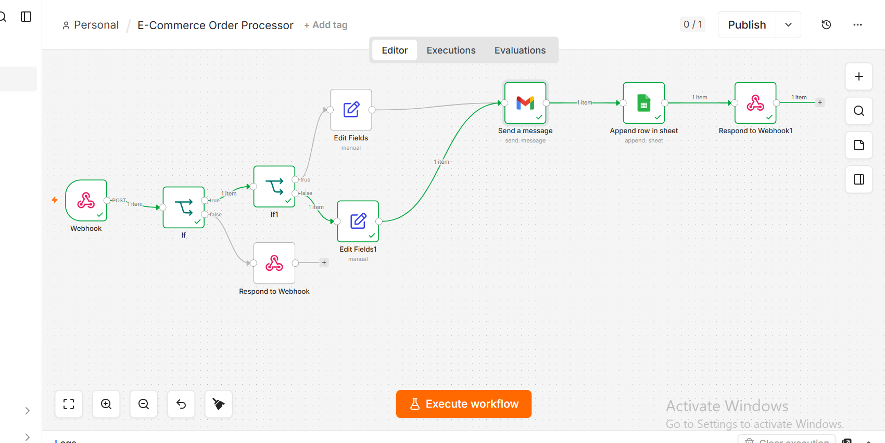

🛒 E-Commerce Order Processor — n8n Automation
> Automated order processing system built with n8n. Validates incoming orders, flags high-value customers, stores data to Google Sheets, and sends instant email notifications — all without manual work.
---
📌 What This Workflow Does
Most small e-commerce businesses process orders manually — checking if payment is done, copying data into spreadsheets, sending confirmation emails. This workflow eliminates all of that.
The moment an order comes in via webhook, the system:
Validates the order (checks email exists, payment is confirmed, total > 0)
Rejects invalid orders instantly with a descriptive error response
Flags high-value orders (total > 5,000) as `High Value`, rest as `Normal`
Saves all valid order data to Google Sheets automatically
Sends an email notification with the lead type in the subject line
Responds to the webhook with a success confirmation
---
🔁 Workflow Structure
```
Webhook (POST)
    │
    ▼
IF — Validate order
    │ false → Respond to Webhook (400 error + reason)
    │ true
    ▼
IF1 — Check total > 5000?
    │ true → Edit Fields (Lead Type = "High Value")
    │ false → Edit Fields (Lead Type = "Normal")
    │
    ▼
Gmail — Send notification email
    │
    ▼
Google Sheets — Append row
    │
    ▼
Respond to Webhook (200 success)
```
---
✅ Validation Rules
An order passes validation only if ALL conditions are true:
Field	Rule
`customer_email`	Must exist and contain `@gmail.com`
`paid`	Must be `true`
`total`	Must be greater than `0`
---
📦 Input Format
Send a POST request to the webhook URL with this JSON body:
```json
{
  "order_id": "ORD-001",
  "customer_name": "Ahmed Khan",
  "customer_email": "ahmed@gmail.com",
  "items": ["laptop", "mouse", "keyboard"],
  "total": 85000,
  "paid": true
}
```
---
📊 Google Sheets Output
Each valid order is saved as a row with these columns:
Name	Email	Order ID	Total	Lead Type
Ahmed Khan	ahmed@gmail.com	ORD-001	85000	High Value
---
🖼️ Workflow Screenshot

---
⚙️ How to Import & Use
Step 1 — Import the workflow
Download `E-Commerce Order Processor.json` from this repo
Open n8n → click + → Import from file
Select the downloaded file
Step 2 — Add your credentials
Go to Settings → Credentials in n8n
Add your Gmail OAuth2 credential
Add your Google Sheets OAuth2 credential
Step 3 — Configure nodes
In the Gmail node: set `sendTo` to your notification email
In the Google Sheets node: connect your spreadsheet
Step 4 — Activate
Click Activate (top right toggle)
Copy the production webhook URL
Send a POST request to test
Step 5 — Test with curl
```bash
curl -X POST "YOUR_WEBHOOK_URL" \
  -H "Content-Type: application/json" \
  -d '{
    "order_id": "ORD-001",
    "customer_name": "Ahmed Khan",
    "customer_email": "ahmed@gmail.com",
    "total": 85000,
    "paid": true
  }'
```
> ⚠️ You must add your own Gmail and Google Sheets credentials before the workflow will run.
---
🛠️ Nodes Used
Node	Purpose
Webhook	Receives incoming order data via POST
IF	Validates order (email, payment, total)
IF1	Checks if order is high value (> 5,000)
Edit Fields	Sets Lead Type as High Value or Normal
Gmail	Sends notification email
Google Sheets	Appends order row to spreadsheet
Respond to Webhook	Returns success or error response
---
📈 Business Value
Eliminates manual order data entry (~3 hours/day saved)
Instant customer and owner notification on every order
Automatic high-value customer flagging for priority handling
Zero missed orders — every submission is captured and validated
---
🚀 More Workflows Coming
This is part of a growing n8n automation portfolio. Next additions:
Lead Capture System (Webhook → Validation → CRM → Notification)
Daily News Digest (Scheduled API fetch → HTML email)
Weather Alert System (Scheduled → Conditional email)
AI-powered workflows (Phase 3 — in progress)
---
👤 About
Built by Huzaifa Nawaz — n8n automation developer building toward AI-powered workflow systems.
🔗 GitHub: github.com/HuzaifaNawazx
📧 Contact: huzaifa.nawaz.work@gmail.com
---
Built as part of a structured n8n automation engineering roadmap — Phase 2: Intermediate Automation.
